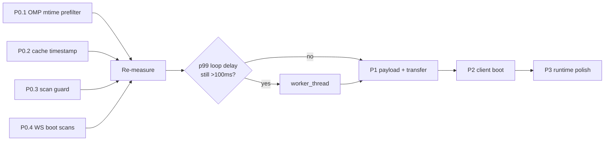

# NFS-5 — ClaudeVille Need For Speed

**Status:** `implemented and verified` (2026-09-01)
Date: 2026-09-01
Owner: performance workstream
Research backing: [`agents/research/nfs-5/`](../research/nfs-5/) (7 independent investigations, all measured)

---

## 0. Implementation status

Every P0-P2 item and P3.1/P3.6/P3.7 landed in full. **P3.5 landed partially by design** (see deviation 4), and the Codex consolidation is committed but **not yet live** (see Still open). Verified against the live server on :4000 after the operator restarted it onto the new code.

### Acceptance targets

| # | Target | Result | |
|---|---|---|---|
| 1 | Static CSS p95 <100 ms, max <1 s, no multi-second window | max **255 ms** and zero stalls across 100 samples both met; p95 **113 ms** is over the 100 ms bar (an earlier 60-sample run measured p95 395 ms, so this varies with load) | ⚠️ partial |
| 2 | Event-loop p99 <100 ms; duty cycle far below 93% | p99 **22.15 ms** (from ~370 ms mid-flight) | ✅ |
| 3 | OMP bytes scale with active files; threshold `0` opens zero | 704 of 722 files skipped before read; threshold `0` opens **0** | ✅ |
| 4 | One collection job, at most one coalesced follow-up | generation guard + backoff in `server.js` | ✅ |
| 5 | First WS frame immediate from snapshot | cached baseline served instantly; cold/resync collect inline | ✅ |
| 6 | Sessions payload <150 KB uncompressed | **149,268 B** raw, **7,153 B** gzipped live | ✅ |
| 7 | Warm reload <200 KB | strong SHA-256 ETag, **304 / 0 B** revalidation | ✅ |
| 8 | Delta results match a full-scan oracle | `r1-18.pipeline-replay` + `boot-contract` green | ✅ |

### Headline measurements

| Metric | Before | After |
|---|---:|---:|
| Static asset worst case | 36.9 s | **0.26 s** |
| Event-loop p99 | ~370 ms | **22 ms** |
| `lastBroadcast.elapsed` | 3,313 ms | **1 ms** |
| Full registry scan (cold) | 10,186 ms | **533-711 ms** |
| Non-forced scan (cache hit) | 9,804 ms | **0.002 ms** |
| OMP pass | 3,840 ms / 941 MB / 158,551 parses | **42 ms / 3.8 MB / 459 parses** |
| Codex warm pass | 35 opens / 105 MB / 23 tail parses | **9 opens / 56 MB / 9 tail parses** |
| Sessions payload | 859,135 B | **149,268 B** raw / **7,153 B** gzipped |
| Sustained tail read rate | 202 MB/s | **36 MB/s** |
| Harbor per-frame (2,000 ships) | 27.765 ms mean | **0.006 ms** mean |
| Overlay layout (100 agents) | 0.161 / 0.244 ms | **0.029 / 0.056 ms** |
| Frame-path allocations | 1,778 /frame | **0** /frame |
| Sidebar DOM churn | 186 nodes/update | **0** nodes/update |
| Boot blocking CSS | 123,888 B | **50,984 B** |
| Boot critical assets | 7.76 MiB / 242 loads | **~1.8-2.1 MiB** (2-3 agents) |

### Deviations from the plan, and why

1. **Worker thread not built.** Correctly gated on measurement: P0.1 cut the scan ~99%, so p99 landed at 22 ms without it. Building it would have added lifecycle and cache-ownership complexity for no measured gain.
2. **P0.4 partially reverted.** The provisional empty init frame broke the wire contract (`r1-18.pipeline-replay` requires real `sessions`/`teams`/`usage` and `seq > 0`). Now: a cached snapshot is served instantly (the actual win), while a cold server or an explicit `resync` collects inline and advances the sequence. Justified because P0.1 made that collection ~42 ms rather than 10 s.
3. **Dashboard module deferral reverted; other P2.3 deferrals kept.** Lazy-loading Dashboard left the panel blank for ~390 ms after a mode switch and broke `ui-remediation`. It is now fetched concurrently with the renderer module and joined before `ready` — no serial round trip added. CSS, `js-yaml`, audio, chronicle UI and the debug overlay remain deferred, which is where the measured win actually was.
4. **P3.5 is partial by design.** The Y-sort is now culled to viewport-adjacent agents, but off-screen agents still run full state simulation: routing, waypoints, position, dwell/cooldown timers, visit reservations, chat convergence, gate transit, arrival/departure, avoidance, facing and animation are load-bearing, and culling them would make agents teleport or desync on scroll-in. Only particle emission is skipped beyond a 420 px apron. Residual cost: `O(A)` simulation remains.
5. **Codex tail consolidation added (not in the original plan).** After P0.1, Codex became the dominant parser (89% of parsed lines) — the priority shift the plan anticipated. Consolidated its three overlapping tail reads into one. The 5,000-record git window was deliberately left unchanged, so behaviour is identical.

### Pre-existing failures, not caused by this work

Both verified failing identically at `HEAD` (f1c1c68) via a throwaway worktree:

- `scripts/smoke/watcher-topology.mjs` — `omp needs a discovery descriptor`. `omp.js` `getWatchPaths()` returns `recursive: true` and no `scope: 'discovery'`, violating two assertions in that smoke test. Worth fixing separately: a recursive descriptor also invites the server's recursive fallback walker over `~/.omp` (1.7 GB).
- `scripts/smoke/world-state-bounds.mjs` — `direct trail rendering must use the same per-agent cap as cached rendering`.

### Still open

- `tailCache` hit rate is **18.6%** against an >80% target. The 128-entry / 32 MiB shared cache is still too small for the working set. Not pursued because absolute read volume already fell 202 → 36 MB/s; revisit only if it shows up in `/api/perf` again.
- The Codex consolidation is committed but **not yet live** — the running server loaded its adapters before that change. It takes effect on the next restart, and should push tail rate and the residual cold-scan cost down further.

---

## 1. Verdict

**The 20-30s dark screen is not a rendering problem. It is server event-loop starvation.**

The Node HTTP thread is blocked ~93% of wall time by synchronous filesystem scanning. The browser cannot get bytes, so it shows nothing. Once bytes arrive the renderer is fine — which is exactly why FPS looks healthy while load feels broken.

A single adapter causes almost all of it: **`adapters/omp.js` reads ~941 MB and runs ~158,000 `JSON.parse` calls on every scan pass**, because it applies its 2-minute activity cutoff *after* parsing instead of before. Only 581 KB of that is actually active data. That is **99.94% pure waste**, repeated every ~2 seconds, forever.

This also explains "getting slower lately" with no code regression: `~/.omp` has grown to 1.7 GB / 338 transcripts through normal use. The cost scales with total history, not with activity. Every session the user runs makes the next boot slower.

### Measured baseline

Probing a 156-line static CSS file against the live server:

| Sample | TTFB |
|---|---:|
| try 1 | 18.195 s |
| try 2-5 | ~0.0007 s |

TCP connect was 0.0003 s throughout — the socket is accepted instantly, the *handler* cannot run. Over a 450 s continuous sample: **~418 s blocked (93%)**, stall lengths 10-37 s, brief ~3 s windows of sub-millisecond service between them.

| Endpoint | Size | Time |
|---|---:|---:|
| `index.html` (static, 19 KB) | 19,089 B | 36.9 s |
| `/api/sessions` | 420,164 B → now 859,135 B | 11.0 s |
| `/api/providers` | 2,040 B | 3.65 s |
| `/api/usage` | 298 B | 7.5 s |

Static serving itself is a victim, not a cause: isolated path checks measured p50 0.021 ms and async reads p50 0.182 ms.

### Cost attribution — one scan pass

| Adapter | Cold | Warm | Bytes read/pass | Share |
|---|---:|---:|---:|---:|
| **OMP** | **4,075 ms** | **4,000 ms** | **941.7 MB** | **93.5%** |
| Codex | 175 ms | 126 ms | 40.0 MB | 4.0% |
| Claude | 18.0 ms | 1.7 ms | 0.3 MB | 0.4% |
| Grok | 5.7 ms | 2.3 ms | 0.13 MB | 0.1% |
| Kimi | 3.3 ms | 1.1 ms | 0.003 MB | <0.1% |

Under live contention the OMP pass measured **12.7 s**. A control run with `activeThresholdMs = 0` (no file can possibly qualify) still read 941,756,247 bytes and returned zero sessions — proving the ordering is causative.

### Live-server confirmation via `/api/perf`

The table above came from isolated in-process benchmarks. Those prove OMP *can* burn 10 s, but not that the live server actually spends its stall there. The running server's own telemetry (`server.js:416`, route at `:2273`) closes that gap independently, and it agrees.

**Stage attribution** — the retained `lastBroadcast` shows where a real broadcast spent its time:

```json
{ "elapsed": 3313,
  "stages": { "sessions": 3312, "teams": 0, "usage": 0, "signature": 1, "delta": 0 },
  "reason": "active-probe", "sessions": 16, "mode": "delta" }
```

**The `sessions` stage is 3,312 of 3,313 ms — 99.97%.** Teams, usage, signature hashing, and delta computation are collectively 1 ms. The scan was triggered by `active-probe`, confirming the probe → dirty → scan chain.

**Adapter attribution** — cumulative `jsonlDiagnostics.parsedLines` since server boot:

| Adapter | Parsed lines | Share |
|---|---:|---:|
| **omp** | **721,438,311** | **98.42%** |
| claude | 7,145,782 | 0.97% |
| codex | 4,370,199 | 0.60% |
| grok | 26,703 | <0.01% |
| kimi | 7,238 | <0.01% |

OMP parses **101× more lines than the next adapter**. Corroborating rates: `tailRate.bytesReadPerSecond` = **202,163,358 B/s sustained**, which matches OMP's isolated 941.7 MB ÷ 4.0 s ≈ 235 MB/s. Cumulative `tailCache.parsed.bytesRead` is **3,957,685,945,294 B ≈ 3.96 TB** read since boot.

**Cache thrash confirmed:** `tailCache.parsed` shows **8,422 hits against 1,560,860 misses — a 0.54% hit rate**, with only 6 entries against a 128-entry limit. The shared cache cannot hold OMP's working set, exactly as predicted.

**Ruled out by the same telemetry** — these were *not* contributing during the sampled window, so do not spend effort on them: `gitRate.commandTimeMsPerSecond` = **0** (git is not on the hot path), `recursiveWatchFallbacks` = **0**, `fallbackScans` idle, `watchFailures` = 0.

> **Telemetry blind spot — fix this early.** `providers` (from `getAdapterPerfStats`) reports `claude, codex, gemini, grok, kimi, opencode` but **has no `omp` key**: `adapters/omp.js` defines no `getPerfStats` (grep count: 0). Anyone ranking cost from the `providers` block alone would see the small adapters and conclude they are the problem, while the consumer responsible for 98.42% of parsed lines reports nothing. OMP was only visible here through the shared `jsonlDiagnostics` and `tailRate` counters. This makes report 02's remediation #6 (add OMP perf counters) a prerequisite for trustworthy verification, not a nice-to-have — see P0.5.

### Why one 10 s scan becomes a 20 s stall

Two independent double-scan paths, both confirmed in source:

1. **Watch-event path** — a directory event schedules `debouncedWatchRefresh` *and* `debouncedBroadcast`. Refresh scans; broadcast then finds the cache expired and scans again.
2. **Reconciliation path** — the 30 s tick calls `getAllSessions({force:true})`, then the same callback calls `broadcastUpdate()` which scans again.

Both are guaranteed to double because of a one-line cache defect: **the registry stamps its cache with the time captured at scan *start*** (`adapters/index.js:356`, using `now` from `:296`). With a 2 s TTL and a 10 s scan, the result is *already 8 s expired when it is stored*. A non-forced call issued immediately afterward measured 9.80 s — a full rescan, not a cache hit.

---

## 2. Execution plan

Ordered by measured impact per unit of risk. **P0 alone should take the dark screen from 20-30 s to under a second.** Do P0 first and re-measure before starting P1 — several lower items may become unnecessary.

### P0 — Unblock the event loop

#### P0.1 Pre-filter OMP transcripts by mtime before reading — *the single highest-value change in the repo*

- **Where:** `claudeville/adapters/omp.js:422-431` (`getActiveSessions`), supported by `_listTranscriptFiles` (`:377`) and `_parseFile` (`:410`).
- **Now:** loops every discovered path and calls `_parseFile` unconditionally; the cutoff lives inside `parseOmpTranscript` at `:176`/`:283`, after every record has been iterated.
- **Change:** `statSync` each discovered path, compare `mtimeMs` against the active cutoff, and `continue` before `_readRecords`. Pass the known `mtimeMs` into parsing so it does not re-stat.
- **Win:** 941.7 MB → 581 KB read per pass (**-99.94%**); OMP pass 4,000-12,700 ms → single-digit ms. Removes ~93.5% of total scan cost.
- **Effort:** Low — a stat and a guard in one loop.
- **Risk:** Low-medium. Append semantics guarantee mtime advances with activity. Two cases need explicit tests: clock skew / future embedded timestamps, and a quiet parent transcript whose child is active. If parent metadata must stay visible, read only that parent's small head once an active child identifies it.
- **Visual consequence:** None.
- **Verify:** Instrument a 338-file fixture and assert only active paths are opened. Benchmark thresholds `0`, `2m`, `30m` — bytes read must scale with active files, not corpus size. Threshold `0` must open zero transcripts. Diff session identity and parentage against current output.

#### P0.2 Stamp the registry cache at completion, and scope invalidation

- **Where:** `claudeville/adapters/index.js:295-299` (age check), `:356` (timestamp store), `:424-432` (invalidation).
- **Now:** stores the scan's *start* timestamp, so any scan longer than the 2 s TTL is born expired. Separately, `invalidateSessionCaches` zeroes the entire all-provider list cache even when the dirty descriptor names a single provider or path.
- **Change:** record `Date.now()` *after* collection completes. Then make invalidation provider-scoped: retain the aggregate and refresh only the named provider.
- **Win:** Eliminates the guaranteed cache miss that turns every double-scan path into two real scans. Stops one chatty provider from forcing a full all-adapter pass.
- **Effort:** Low for the timestamp (one line); medium for scoped invalidation.
- **Risk:** Low / medium respectively. Scoped invalidation needs a slow full reconciliation retained as a safety net.
- **Verify:** After a scan, an immediate non-forced call must hit cache (currently measured at 9.80 s). Assert scoped invalidation matches a forced full-scan oracle.

#### P0.3 Add a scan-generation guard and coalesce refresh + broadcast

- **Where:** `claudeville/server.js:1119-1155` (`markProviderDataDirty`), `:1246-1366` (`broadcastUpdate`), `:1781-1791` (`refreshWatchPaths`), `:2233-2259` (scheduler).
- **Now:** no in-flight flag, scan promise, or dirty generation anywhere. Existing coalescing is only a 100 ms same-descriptor debounce — different paths are distinct keys.
- **Change:** introduce a monotonic dirty generation and one scan coordinator. Produce one collection result per generation, never rescan while that snapshot is current, and carry a single follow-up generation rather than one job per event. Add adaptive backoff so the next scan is gated on a function of the last scan's measured duration.
- **Win:** Collapses both double-scan paths — roughly halves whatever stall remains after P0.1.
- **Effort:** Medium. **Risk:** Medium — this is also a hard prerequisite for any future async conversion, which would otherwise allow overlapping scans and make things worse.
- **Verify:** Assert exactly one collection job active, at most one coalesced follow-up, and zero same-generation refresh+broadcast duplicates.

#### P0.4 Stop the first WebSocket client from forcing two scans

- **Where:** `claudeville/server.js:679-695` (`onFirstWebSocketClient`), `:954-983` (`sendInitialData`, forced scan at `:970`).
- **Now:** connection synchronously calls `refreshWatchPaths()` (which scans), then 100 ms later `sendInitialData` forces another full scan. This lands precisely on the boot critical path — it *is* the user's dark screen.
- **Change:** serve the most recent snapshot immediately with an explicit `scanning`/`staleAt` flag; let the fresh result arrive as a normal update.
- **Win:** Removes two full scans from first paint.
- **Effort:** Low-medium. **Risk:** Low. **Visual consequence:** world appears immediately, possibly with slightly stale data for one tick — strictly better than a black screen.
- **Verify:** Connect a WS client during a scan; initial frame must arrive in ms.

#### P0.5 Give OMP perf counters so verification is trustworthy

- **Where:** `claudeville/adapters/omp.js` — add `getPerfStats()`, matching the shape the other adapters already expose to `getAdapterPerfStats()`.
- **Now:** OMP is the only available adapter with no `getPerfStats`, so it is absent from `/api/perf` → `providers` despite being 98.42% of parsed lines. The dominant cost is invisible in the one place an engineer would look.
- **Change:** report discovered, stat'd, skipped-before-read, opened, bytes read, parsed lines, cache hits/misses, and pass duration.
- **Win:** No direct latency win — this is what makes every other P0 item *verifiable*, and it prevents a silent regression from reintroducing corpus-wide scanning unnoticed.
- **Effort:** Low. **Risk:** Low, provided counters stay cheap and never stringify paths or payloads. **Visual consequence:** none.
- **Verify:** After P0.1, `providers.omp` must show bytes and opens scaling with active files; a threshold-`0` request must report zero transcripts opened.

> **Deliberately deferred: the worker thread.** Report 01 recommends moving collection into a `worker_thread` as the primary architecture. That is the right call *given a 10 s scan* — but P0.1 removes ~93.5% of that cost, and a ~50 ms scan does not justify worker lifecycle, serialization, and cache-ownership complexity. **Gate this behind measurement:** implement it only if, after P0, event-loop delay p99 still exceeds 100 ms. Do not build it speculatively.

### P1 — Payload and transfer

#### P1.1 Deduplicate git events in the sessions payload

- **Where:** `adapters/gitEvents.js`, consumed via the sessions snapshot.
- **Measured:** snapshot is **859,135 B** — already up **104%** from the 420,164 B measured earlier the same day, so this is actively growing. `gitEvents` is **828,493 B = 96.43%** of it. 974 git rows carry only **90 unique event IDs**; ~688,536 B is duplication. Without gitEvents the response is **30,621 B**.
- **Change:** emit each unique event once at project level and reference it by ID per session. Largest sub-fields: commands 163,107 B, labels 88,825 B, projects 51,622 B, SHAs 45,264 B.
- **Win:** ~859 KB → ~100 KB. Cuts serialization (blocking), transfer, and client `JSON.parse` together.
- **Effort:** Medium. **Risk:** Medium — client must resolve references. **Visual consequence:** none if resolution is faithful.
- **Verify:** Byte-count assertion; identical rendered git activity before/after.

#### P1.2 Enable gzip on HTTP responses

- **Where:** `claudeville/server.js` response path.
- **Measured:** no `Content-Encoding` is negotiated today. The snapshot gzips **859,135 B → 142,543 B (-83%)**.
- **Change:** negotiate `Accept-Encoding` and gzip JSON/JS/CSS responses. Skip already-compressed PNGs.
- **Win:** Large, and it compounds with P1.1. **Effort:** Low. **Risk:** Low. **Visual consequence:** none.
- **Note:** do this for HTTP only. WebSocket `permessage-deflate` would have to be hand-written against the hand-rolled WS implementation — not worth it once P1.1 lands.

#### P1.3 Remove the REST + WebSocket boot duplication

- **Measured:** normal boot ingests a REST snapshot and then an immediate WS full snapshot carrying the same data — **≥1,718,270 B** transferred and parsed for one boot.
- **Change:** pick one source of truth for the initial payload.
- **Win:** halves boot ingestion bytes and parse time. **Effort:** Low-medium. **Risk:** Low — needs care that no state is only present on one path.

#### P1.4 Add ETag / 304 revalidation for static files

- **Where:** `claudeville/server.js:178-186` (`cacheControlFor`) and the static handler.
- **Now:** every `.js` and `.css` is served `no-cache` with **no ETag, no Last-Modified, and no conditional-request handling**. A warm reload re-downloads **≥3.94 MB across 154 requests**.
- **Change:** honour `If-None-Match` and emit a validator. **Validator strength matters and is easy to get wrong:** `mtime+size` is *not* byte identity — a same-size edit within one mtime tick collides, and some filesystems only give 1 s mtime granularity. Under RFC 9110 a metadata-derived validator must therefore be **weak** (`W/"<mtime>-<size>"`). Weak validators are fully permitted for `If-None-Match` on GET, so 304 revalidation still works correctly. **Preferred:** emit a **strong** ETag from a content hash, memoised on `(path, mtime, size)` so it is computed once per edit, not per request. These files total 3.94 MB, so hashing is cheap and it removes the collision hazard entirely — which matters here because a stale 304 on an edited module in a live-edit, zero-build workflow produces exactly the kind of baffling phantom bug that costs hours. Keep `no-cache` so edits still apply instantly.
- **Win:** 3.94 MB → a few KB of 304s on warm reload. **Effort:** Low. **Risk:** Low. **Visual consequence:** none.
- **Note:** HTTP keep-alive is already enabled; connection churn is *not* a problem. Sprite/font URLs already carry `?v=` correctly and are already `immutable` — only the manifest and palette YAML fetches remain unversioned.

### P2 — Client boot critical path

Only meaningful after P0; today these are dwarfed by server stalls.

#### P2.1 Load only active agents' character sheets

- **Where:** `src/presentation/character-mode/AssetManager.js`, gated by `App.js:248`.
- **Measured:** default World boot gates first paint on **242 loads / 7.76 MiB**. All **21** character sheets load eagerly regardless of who is present; character albedo alone is 3.91 MiB.
- **Change:** load sheets for present profiles, fetch others on demand at agent arrival. Loads are already parallel via `Promise.all`, so this is a set-reduction, not a concurrency fix.
- **Win:** critical assets **5.22 MiB → ~1.55-2.14 MiB** for a typical 2-3 agent session.
- **Effort:** Medium. **Risk:** Medium — needs a clean on-demand arrival path. **Visual consequence:** a late-arriving agent may pop in a frame or two after its sheet lands.

#### P2.2 Parallelize the boot waterfall

- **Where:** `src/presentation/App.js:248-262`.
- **Now:** strictly serial — API sync → all base sprites → materials → renderer module → dashboard renderer.
- **Change:** API fetch, asset loading, YAML parse, and renderer *module* fetching are independent; run them concurrently and join before first draw.
- **Win:** collapses several serial round trips. **Effort:** Low-medium. **Risk:** Low.

#### P2.3 Defer non-critical modules and CSS

- **Measured:** browser boot is **141 modules / 3.63 MB** at **7 dependency levels** (depth sets the number of serial round trips). Only 3 dynamic imports exist in the whole codebase. Default boot pulls in 3 dashboard modules it does not need.
- **Change:** `import()` the activity panel, audio, Chronicle UI, Dashboard mode, and debug overlay. Add targeted `<link rel="modulepreload">` for the known-deep critical chain to flatten the waterfall without a build step. Defer the 3 hidden-feature stylesheets (**72.9 KB** of the 123,888 B blocking CSS; deferring dashboard + activity-panel CSS removes 50.6% of initial CSS). Move the synchronous `<head>` `js-yaml` to load with the sprite manifest that actually needs it.
- **Win:** fewer serial round trips and less blocking parse. **Effort:** Medium. **Risk:** Low-medium. **Visual consequence:** none if deferred surfaces load before first interaction.
- **Note:** simulator fixtures are already correctly excluded from normal boot — no action.

### P3 — Sustained runtime

The 60 FPS reading is real but **not trustworthy as a health signal**: it is a 500 ms average of renderer rAF callbacks, not presentation latency or GPU completion, so it cannot show p95/p99 hitches, GC pauses, input delay, dropped frames, or GPU queueing.

| # | Item | Location | Measured | Change |
|---|---|---|---|---|
| P3.1 | Harbor history — the real runtime ageing regression | `HarborTraffic.js` | 2,000 retained ships cost **2.21 ms mean / 4.32 ms p95** to produce only **10 drawables** | Cache packed frames; cap retained history |
| P3.2 | Label/bubble placement is worst-case **O(A²)** and runs *before* viewport culling | overlay layout | scales with total agents | Pre-cull, then spatial layout |
| P3.3 | Per-frame garbage | GPU/scene build | drawable wrappers, GPU records, batches, diagnostics, arrays, Maps, Sets, strings, closures all recreated every frame | Reuse pooled packets |
| P3.4 | No dirty-frame idling in active World mode | render loop | redraws continuously even when nothing changed | Skip redraw on unchanged scene |
| P3.5 | All agents simulate off-screen; moving agents trigger `O(A log A)` sort | agent sim | scales with total, not visible | Cull before simulate/sort |
| P3.6 | Sidebar rebuilds its full tree | `Sidebar.js` | up to **5,520+ element creations/minute** at 20 agents | Patch in place, as Dashboard cards already do |
| P3.7 | Honest telemetry | `ClientPerfMetrics.js` | 500 ms rAF average hides everything | Report frame-time p50/p95/p99, long tasks, dropped frames |

Confirmed healthy — **do not spend time here:** hidden tabs and Dashboard mode already stop World rendering and release resources; ActivityPanel feeds are signature-guarded and bounded with no append-only DOM growth; Dashboard cards are persistent and patched (zero nodes per update); DPR is already capped; chronicle events are bounded (20,000 rows / 14 days) and SpendLedger retains 5 minutes; no broad unbounded leak exists; sprite assets are already well compressed with zero orphans or duplicate visible art.

Lower-priority CSS: perpetual `box-shadow` and `background-position` animations are the most expensive remaining style cost.

---

## 3. Sequencing



P0.1 and P0.2 are independent one-to-few-line changes in different files and can land together immediately. Do not start P2 or P3 before re-measuring after P0 — the priorities below P0 are estimated against a baseline that P0 destroys.

---

## 4. Acceptance targets

1. Static CSS **p95 TTFB < 100 ms, max < 1 s** during a forced full scan with continuous file changes. No multi-second black window.
2. Event-loop delay **p99 < 100 ms**; blocked duty cycle far below the measured ~93%.
3. OMP bytes read per pass scale with **active** files, not corpus size. Threshold `0` opens zero transcripts.
4. Exactly one collection job active; at most one coalesced follow-up generation.
5. First HTTP byte independent of startup discovery; first WS frame served immediately from the last snapshot with an explicit `scanning` flag.
6. Sessions payload **< 150 KB** uncompressed after git-event dedup.
7. Warm reload transfers **< 200 KB** (304s) instead of 3.94 MB.
8. Incremental results match a forced full-scan oracle across append, truncate, rename, delete, and git-ref changes.

## 5. Verification commands

```bash
node --check claudeville/adapters/omp.js
node --check claudeville/server.js
npm run test:unit
node scripts/smoke/adapters.mjs
npm run validate:quick
```

### The primary gate: `/api/perf`

Latency probes prove *that* the loop blocks; `/api/perf` proves *what* blocked it and by how much. Use it as the primary gate — it is cheap, already built, and needs no client.

```bash
curl -s http://localhost:4000/api/perf -o /tmp/perf.json

# 1. Stage attribution — `sessions` must no longer dominate `elapsed`
jq '.lastBroadcast | {elapsed, stages, reason}' /tmp/perf.json

# 2. Adapter attribution — omp must fall from 98.42% to negligible
jq '.jsonlDiagnostics | to_entries
    | map({adapter:.key, lines:.value.parsedLines})
    | sort_by(-.lines)' /tmp/perf.json

# 3. Sustained read rate — must collapse from 202 MB/s
jq '.tailRate | {bytesReadPerSecond, parsedLinesPerSecond}' /tmp/perf.json

# 4. Cache health — hit rate must rise from 0.54%
jq '.tailCache.parsed | {hits, misses, rate: (.hits/(.hits+.misses)*100)}' /tmp/perf.json

# 5. Event loop — p99 must drop under 100 ms
jq '.runtime.eventLoop' /tmp/perf.json

# 6. After P0.5, OMP must finally appear here
jq '.providers | keys' /tmp/perf.json
```

| Signal | Baseline (measured) | Target |
|---|---:|---:|
| `lastBroadcast.stages.sessions` share | 99.97% | not dominant |
| `jsonlDiagnostics.omp.parsedLines` share | 98.42% | <10% |
| `tailRate.bytesReadPerSecond` | 202,163,358 | <5,000,000 |
| `tailCache.parsed` hit rate | 0.54% | >80% |
| `runtime.eventLoop.delayMs.p99` | see note | <100 ms |

> Sample `/api/perf` **while a session is actively running** — with no active agents the server goes idle (`utilization` 0.003) and every counter looks healthy. The stall only reproduces under real session activity, which is precisely why it hits at boot.

### Secondary gate: latency probe

```bash
for i in $(seq 1 60); do
  printf '%s %s\n' "$(date +%s)" \
    "$(curl -s -o /dev/null -w '%{time_total}' --max-time 60 http://localhost:4000/css/reset.css)"
  sleep 0.3
done
```

Every sample must stay in the millisecond range. Any multi-second entry means the loop is still being blocked.

Browser verification stays manual (no browser or component test runner exists): open `http://localhost:4000`, confirm the world paints in under a second, then exercise World + Dashboard, agent select/deselect, and resize.

---

## 6. Research index

| Report | Scope | Headline |
|---|---|---|
| [01-server-eventloop.md](../research/nfs-5/01-server-eventloop.md) | scheduler, caches, startup | 10 s scans on the HTTP thread; two double-scan paths; cache stamped at start |
| [02-adapters-scan.md](../research/nfs-5/02-adapters-scan.md) | adapter internals | OMP 941.7 MB/pass, 93.5% of cost; cutoff after parse |
| [03-client-boot.md](../research/nfs-5/03-client-boot.md) | module graph, caching | 141 modules, depth 7, no ETag, 3.94 MB warm reload |
| [04-renderer.md](../research/nfs-5/04-renderer.md) | canvas/GPU | FPS metric is a rAF average; Harbor history; O(A²) overlay |
| [05-wire-protocol.md](../research/nfs-5/05-wire-protocol.md) | payload shape | 859 KB snapshot, 96.4% gitEvents, 688 KB duplication |
| [06-dom-ui.md](../research/nfs-5/06-dom-ui.md) | DOM/CSS | Sidebar full-tree rebuild; 50.6% of CSS deferrable |
| [07-assets.md](../research/nfs-5/07-assets.md) | sprites | 7.76 MiB gates first paint; all 21 sheets eager |
